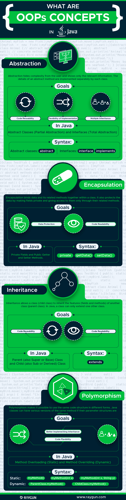

- see: https://raygun.com/blog/oop-concepts-java/
---
#6 OOP Concepts in Java with examples

Java is a class-based object-oriented programming (OOP) language that is built around the concept of objects. OOP concepts (OOP) intend to improve code readability and reusability by defining how to structure a Java program efficiently. The main principles of object-oriented programming are:

1.  [Abstraction](https://raygun.com/blog/oop-concepts-java/#abstraction)
2.  [Encapsulation](https://raygun.com/blog/oop-concepts-java/#encapsulation)
3.  [Inheritance](https://raygun.com/blog/oop-concepts-java/#inheritance)
4.  [Polymorphism](https://raygun.com/blog/oop-concepts-java/#polymorphism)
5.  [Association](https://raygun.com/blog/oop-concepts-java/#association)
6.  [Aggregation](https://raygun.com/blog/oop-concepts-java/#aggregation)
7.  [Composition](https://raygun.com/blog/oop-concepts-java/#composition)

Java comes with specific code structures for each OOP principle. For example, the `extends` keyword for inheritance or getter and setter methods for encapsulation.

## What are OOP concepts in Java?

OOP concepts allow us to create specific interactions between Java objects. They make it possible to reuse code without creating security risks or making a Java program less readable.

Here are the four main principles in more detail.

### Abstraction

Abstraction aims to hide complexity from the users and show them only the relevant information. For example, if you want to drive a car, you don’t need to know about its internal workings. The same is true of Java classes. You can hide internal implementation details by using abstract classes or interfaces. On the abstract level, you only need to define the method signatures (name and parameter list) and let each class implement them in their own way.

**Abstraction in Java:**

-   Hides the underlying complexity of data
-   Helps avoid repetitive code
-   Presents only the signature of internal functionality
-   Gives flexibility to programmers to change the implementation of the abstract behaviour
-   Partial abstraction (0-100%) can be achieved with abstract classes
-   Total abstraction (100%) can be achieved with interfaces

### Encapsulation

Encapsulation allows us to protect the data stored in a class from system-wide access. As its name suggests, it safeguards the internal contents of a class like a real-life capsule. You can implement encapsulation in Java by keeping the fields (class variables) private and providing public getter and setter methods to each of them. Java Beans are examples of fully encapsulated classes.

**Encapsulation in Java:**

-   Restricts direct access to data members (fields) of a class.
-   Fields are set to private
-   Each field has a getter and setter method
-   Getter methods return the field
-   Setter methods let us change the value of the field

### Polymorphism

[Polymorphism](https://en.wikipedia.org/wiki/Polymorphism)refers to the ability to perform a certain action in different ways. In Java, polymorphism can take two forms: method overloading and method overriding. Method overloading happens when various methods with the same name are present in a class. When they are called they are differentiated by the number, order, and types of their parameters. Method overriding occurs when the child class overrides a method of its parent.

**Polymorphism in Java:**

-   The same method name is used several times.
-   Different methods of the same name can be called from the object.
-   All Java objects can be considered polymorphic (at the minimum, they are of their own type and instances of the Object class).
-   Example of static polymorphism in Java is method overloading.
-   Example of dynamic polymorphism in Java is method overriding.

### Inheritance

[Inheritance](https://raygun.com/blog/oop-concepts-java/www.linkedin.com/pulse/types-relationships-object-oriented-programming-oop-sarah-el-dawody/) makes it possible to create a child class that inherits the fields and methods of the parent class. The child class can override the values and methods of the parent class, however it’s not necessary. It can also add new data and functionality to its parent. Parent classes are also called superclasses or base classes, while child classes are known as subclasses or derived classes as well. Java uses the `extends` keyword to implement the principle of inheritance in code.

**Inheritance in Java:**

-   A class (child class) can extend another class (parent class) by inheriting its features.
-   Implements the DRY (Don’t Repeat Yourself) programming principle.
-   Improves code reusability.
-   Multilevel inheritance is allowed in Java (a child class can have its own child class as well).
-   Multiple inheritances are not allowed in Java (a class can’t extend more than one class).

### Association

Besides the four main principles of OOP, Java also works with three further concepts (association, aggregation, composition) you can make use of when designing your programs. _Aggregation_ is a special form of _association_, while _composition_ is a special form of _aggregation_.

[Association](https://javapapers.com/oops/association-aggregation-composition-abstraction-generalization-realization-dependency/) simply means the act of establishing a relationship between two unrelated classes. For example, when you declare two fields of different types (e.g. `Car` and `Bicycle`) within the same class and make them interact with each other, you have performed association.

**Association in Java:**

-   Two separate classes are associated through their objects.
-   The two classes are unrelated, each can exist without the other one.
-   Can be a one-to-one, one-to-many, many-to-one, or many-to-many relationship.

### Aggregation

[Aggregation](https://beginnersbook.com/2013/05/aggregation/) is a narrower kind of association. It occurs when there’s a one-way (HAS-A) relationship between the two classes you associate through their objects. For example, every `Passenger` has a `Car` but a `Car` doesn’t necessarily have a `Passenger`. When you declare the `Passenger` class, you can create a field of the `Car` type that shows which car the passenger belongs to. Then, when you instantiate a new `Passenger` object, you can access the data stored in the related `Car` as well.

**Aggregation in Java:**

-   One-directional association.
-   Represents a HAS-A relationship between two classes.
-   Only one class is dependent on the other.

### Composition

[Composition](https://www.infoworld.com/article/3029325/application-development/exploring-association-aggregation-and-composition-in-oop.html)is a stricter form of aggregation. It occurs when the two classes you associate are mutually dependent on each other and can’t exist without each other. For example, take a `Car` and an `Engine` class. A `Car` cannot run without an `Engine`, while an `Engine` also can’t function without being built into a `Car`. This kind of relationship between objects is also called a PART-OF relationship.

Composition in Java:

-   A restricted form of aggregation
-   Represents a PART-OF relationship between two classes
-   Both classes are dependent on each other
-   If one class ceases to exist, the other can’t survive alone

### OOP Concepts in Java infographic



[comment]: <> (![OOP concepts in Java infographic]&#40;https://raygun.com/blog/images/oop-concepts-java/oops-concepts-infographic.png&#41;)

## What are the characteristics of OOP?

Now, let’s see the real-life characteristics of the four main OOP concepts in Java: abstraction, encapsulation, inheritance, and polymorphism.

### Abstraction

With abstraction, you can hide the internal workings of an object and only show the features the user needs to know about. Java provides two ways to implement abstraction: abstract classes and interfaces. With abstract classes, you can achieve partial abstraction, while interfaces make total (100%) abstraction possible.

#### Abstract classes

An abstract class is a superclass (parent class) that cannot be instantiated. You need to instantiate one of its child classes if you want to create a new object. Abstract classes can have both abstract and concrete methods. Abstract methods contain only the method signature, while concrete methods declare a method body as well. Abstract classes are defined with the `abstract` keyword.

In the example below, you can see an abstract class called `Animal` with two abstract and one concrete method.

```
abstract class Animal {
// abstract methods
abstract void move();
abstract void eat();

// concrete method
void label() {
System.out.println("Animal's data:");
}
}
```

Extend the `Animal` abstract class with two child classes: `Bird` and `Fish`. Both of them set up their own functionality for the `move()` and `eat()` abstract methods.

```
class Bird extends Animal {

void move() {
 System.out.println("Moves by flying.");
     }
void eat() {
 System.out.println("Eats birdfood.");
} 
}

class Fish extends Animal {
 void move() {
 System.out.println("Moves by swimming.");
     }
 void eat() {
 System.out.println("Eats seafood.");
 }
}
```

Now, test it with the `TestBird` and `TestFish` classes. Both call the one concrete (`label()`) and the two abstract (`move()` and `eat()`) methods.

```
class TestBird {
public static void main(String[] args) {
Animal myBird = new Bird();

myBird.label();
myBird.move();
myBird.eat();
}
}

class TestFish {
public static void main(String[] args) {
Animal myFish = new Fish();

myFish.label();
myFish.move();
myFish.eat();
}
}
```

In the console, the concrete method has been called from the `Animal` abstract class, while the two abstract methods have been called from `Bird()` and `Fish()`, respectively.

```
[Console output of TestBird]
Animal's data:
Moves by flying.
Eats birdfood.

[Console output of TestFish]
Animal's data:
Moves by swimming.
Eats seafood.
```

#### Interfaces

An interface is a 100% abstract class. It can have only static, final, and public fields and abstract methods. It’s frequently referred to as a blueprint of a class as well. Java interfaces allow us to implement multiple inheritance in our code, as a class can implement any number of interfaces. Classes can access an interface using the `implements` keyword.

In the example, define two interfaces, `Animal` and `Bird`. `Animal` has two abstract methods, while `Bird` has two static fields and an abstract method.

```
interface Animal {
public void eat();
public void sound();
}

interface Bird {
int numberOfLegs = 2;
String outerCovering = "feather";

public void fly();
}
```

The class `Eagle` implements both interfaces. It defines its own functionality for the three abstract methods. The `eat()` and `sound()` methods come from the `Animal` class, while `fly()` comes from `Bird`.

```
class Eagle implements Animal, Bird {
public void eat() {
System.out.println("Eats reptiles and amphibians.");
}
public void sound() {
System.out.println("Has a high-pitched whistling sound.");
}
public void fly() {
System.out.println("Flies up to 10,000 feet.");
}
}
```

In the `TestEagle` test class, instantiate a new `Eagle` object (called `myEagle`) and print out all the fields and methods to the console.

As static fields don’t belong to a specific object but to a whole class, you need to access them from the `Bird` interface instead of the `myEagle` object.

```
class TestEagle {
public static void main(String[] args) {
Eagle myEagle = new Eagle();

myEagle.eat();
myEagle.sound();
myEagle.fly();

System.out.println("Number of legs: " + Bird.numberOfLegs);
System.out.println("Outer covering: " + Bird.outerCovering);
}
}
```

The Java console returns all the information you wanted to access:

```
[Console output of TestEagle]
Eats reptiles and amphibians.
Has a high-pitched whistling sound.
Flies up to 10,000 feet.
Number of legs: 2
Outer covering: feather
```

### Encapsulation

With encapsulation, you can protect the fields of a class. To do so, declare the fields as private and providing access to them with getter and setter methods.

The `Animal` class below is fully encapsulated. It has three private fields and each of them has its own set of getter and setter methods.

```
class Animal {
private String name;
private double averageWeight;
private int numberOfLegs;

// Getter methods
public String getName() {
return name;
}
public double getAverageWeight() {
return averageWeight;
}
public int getNumberOfLegs() {
return numberOfLegs;
}

// Setter methods
public void setName(String name) {
this.name = name;
}
public void setAverageWeight(double averageWeight) {
this.averageWeight = averageWeight;
}
public void setNumberOfLegs(int numberOfLegs) {
this.numberOfLegs = numberOfLegs;
}
}
```

The `TestAnimal` class first sets a value for each field with the setter methods, then prints out the values using the getter methods.

```
public class TestAnimal {
public static void main(String[] args) {
Animal myAnimal = new Animal();

myAnimal.setName("Eagle");
myAnimal.setAverageWeight(1.5);
myAnimal.setNumberOfLegs(2);

System.out.println("Name: " + myAnimal.getName());
System.out.println("Average weight: " + myAnimal.getAverageWeight() + "kg");
System.out.println("Number of legs: " + myAnimal.getNumberOfLegs());
}
}
```

As you can see below, the Java console returns properly all the values you set with the setter methods:

```
[Console output of TestAnimal]
Name: Eagle
Average weight: 1.5kg
Number of legs: 2
```

### Inheritance

Inheritance allows us to extend a class with child classes that inherit the fields and methods of the parent class. It’s an excellent way to achieve code reusability. In Java, we need to use the `extends` keyword to create a child class.

In the example, the `Eagle` class extends the `Bird` parent class. It inherits all of its fields and methods, plus defines two extra fields that belong only to `Eagle`.

```
class Bird {
public String reproduction = "egg";
public String outerCovering = "feather";

public void flyUp() {
System.out.println("Flying up...");
}
public void flyDown() {
System.out.println("Flying down...");
}
}

class Eagle extends Bird {
public String name = "eagle";
public int lifespan = 15;
}
```

The `TestEagle` class instantiates a new `Eagle` object and prints out all the information (both the inherited fields and methods and the two extra fields defined in the `Eagle` class).

```
class TestEagle {
public static void main(String[] args) {
Eagle myEagle = new Eagle();

System.out.println("Name: " + myEagle.name); System.out.println("Reproduction: " + myEagle.reproduction);
System.out.println("Outer covering: " + myEagle.outerCovering);
System.out.println("Lifespan: " + myEagle.lifespan); 
myEagle.flyUp();
myEagle.flyDown(); 
}
}
```

You can see the console output below:

```
[Console output of TestEagle]
Reproduction: another egg
Outer covering: feather
Lifespan: 15
Flying up...
Flying down...
```

### Polymorphism

Polymorphism makes it possible to use the same entity in different forms. In Java, this means that you can declare several methods with the same name until they are different in certain characteristics. Java provides us with two ways to implement polymorphism: method overloading and method overriding.

#### Static polymorphism

Method overloading means that you can have several methods with the same name within a class. However, the number, names, or types of their parameters need to be different.

For example, the `Bird()` class below has three `fly()` methods. The first one doesn’t have any parameters, the second one has one parameter (`height`), and the third one has two parameters (`name` and `height`).

```
class Bird {
public void fly() {
System.out.println("The bird is flying.");
}
public void fly(int height) {
System.out.println("The bird is flying " + height + " feet high.");
}
public void fly(String name, int height) {
System.out.println("The " + name + " is flying " + height + " feet high.");
}
}
```

The test class instantiates a new `Bird` object and calls the `fly()` method three times. Firstly, without parameters, secondly, with one integer parameter for `height`, and thirdly, with two parameters for `name` and `height`.

```
class TestBird {
public static void main(String[] args) {
Bird myBird = new Bird();

myBird.fly();
myBird.fly(10000);
myBird.fly("eagle", 10000);
}
}
```

In the console, we can see that Java could have differentiated the three polymorphic `fly()` methods:

```
[Console output of TestBird]
The bird is flying.
The bird is flying 10000 feet high.
The eagle is flying 10000 feet high.
```

#### Dynamic polymorphism

By using the method overriding feature of Java, you can override the methods of a parent class from its child class.

The `Bird` class extends the `Animal` class in the example below. Both have an `eat()` method. By default, `Bird` inherits its parent’s `eat()` method. However, as it also defines its own `eat()` method, Java will override the original method and call `eat()` from the child class.

```
class Animal {
public void eat() {
System.out.println("This animal eats insects.");
}
}

class Bird extends Animal {

public void eat() {
System.out.println("This bird eats seeds.");
}

}
```

The `TestBird` class first instantiates a new `Animal` object and calls its `eat()` method. Then, it also creates a `Bird` object and calls the polymorphic `eat()` method again.

```
class TestBird {
public static void main(String[] args) {
Animal myAnimal = new Animal();
myAnimal.eat();

Bird myBird = new Bird();
myBird.eat();
}
}
```

The console returns the values of the relevant methods properly. Therefore Java could have differentiated the two `eat()` methods indeed.

```
[Console output of TestBird]
This animal eats insects.
This bird eats seeds.
```

## Conclusion

OOP concepts in Java define how to structure a Java problem more efficiently.
